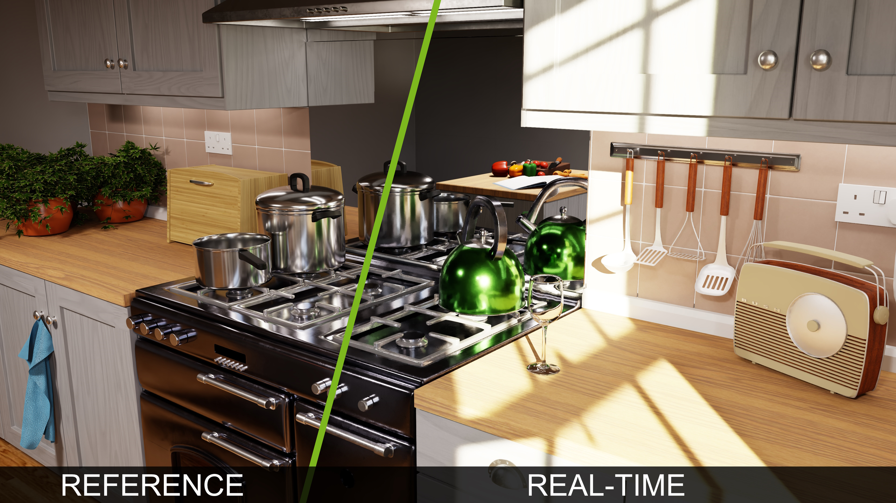
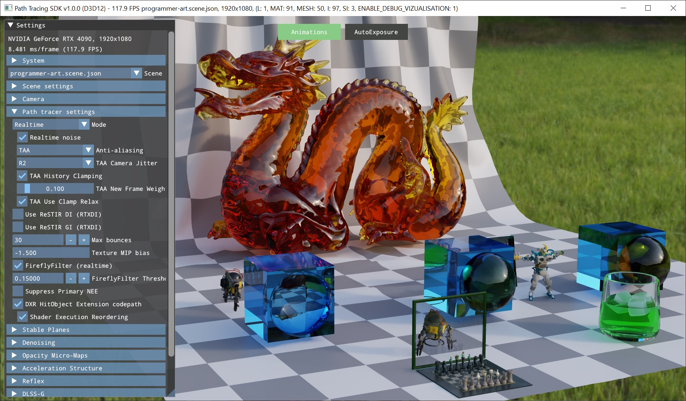

# Path Tracing SDK v1.0.0



## Overview

Path Tracing SDK is a code sample that strives to embody years of ray tracing and neural graphics research and experience. It is intended as a starting point for a path tracer integration, as a reference for various integrated SDKs, and/or for learning and experimentation.

The base path tracing implementation derives from NVIDIA’s [Falcor Research Path Tracer](https://github.com/NVIDIAGameWorks/Falcor), ported to approachable C++/HLSL [Donut framework](https://github.com/NVIDIAGameWorks/donut).

## Features

* DirectX 12 and Vulkan back-ends
* Reference and real-time modes
* Simple BSDF model that is easy to extend
* Simple asset pipeline based on glTF 2.0 (support for a subset of glTF extensions including animation)
* NEE/visibility rays and importance sampling for environment maps with MIS
* Basic volumes and nested dielectrics with priority
* RayCone for texture MIP selection
* Basic analytic lights (directional, spot, point)
* [RTXDI](https://github.com/NVIDIAGameWorks/RTXDI) integration for ReSTIR DI (light importance sampling) and and ReSTIR GI (indirect lighting)
* [OMM](https://github.com/NVIDIAGameWorks/Opacity-MicroMap-SDK) integration for fast ray traced alpha testing
* [NRD](https://github.com/NVIDIAGameWorks/RayTracingDenoiser) ReLAX and ReBLUR denoiser integration with up to 3-layer path space decomposition (Stable Planes)
* Reference mode 'photo-mode screenshot' with basic [OptiX denoiser](https://developer.nvidia.com/optix-denoiser) integration
* Basic TAA, tone mapping, etc.
* Streamline + DLSS integration (coming very soon)

## Known Issues

* DLSS is currently not enabled due to upgrade to Streamline 2.0; integration is work in progress
* SER support on Vulkan is currently work in progress

## Requirements

- Windows 10 20H1 (version 2004-10.0.19041) or newer
- DXR Capable GPU
- GeForce Game Ready Driver 531.18 or newer
- DirectX 12 or Vulkan API
- DirectX Raytracing 1.1 API, or higher
- Visual Studio 2019 or later

## Folder Structure

|						| |  
| -						| - |
| /bin					| default folder for binaries and compiled shaders
| /build				| default folder for build files
| /donut				| code for a custom version of the Donut framework  
| /donut/nvrhi    | code for the NVRHI rendering API layer (a git submodule)
| /external			| external libraries and SDKs, including NRD, RTXDI, and OMM
| /media				| models, textures, scene files  
| /tools				| optional command line tools (denoiser, texture compressor, etc)
| /pt_sdk				| **Path Tracing SDK core; Sample.cpp/.h/.hlsl contain entry points**
| /pt_sdk/PathTracer	| **Core path tracing shaders**


## Build

At the moment, only Windows builds are supported. We are going to add Linux support in the future.

1. Clone the repository **with all submodules recursively**:
   
   `git clone --recursive https://github.com/NVIDIAGameWorks/Path-Tracing-SDK.git`

2. Pull the media files from Packman:
   
   ```
   cd Path-Tracing-SDK
   update_dependencies.bat
   ```
   
3. Create a build folder.

   ```
   mkdir build
   cd build
   ```

   Any folder name works, but git is configured to ignore folders named `build\*`

4. Use CMake to configure the build and generate the project files.
   
   Use of CMake GUI is recommended but `cmake ..` works too. Make sure to select the x64 platform for the generator. 

5. Build the solution generated by CMake in the build folder.

   Open the generated solution (i.e. `build/PathTracingSDK.sln`) with Visual Studio and build it.

6. Select and run the `pt_sdk` project. Binaries get built to the `bin` folder. Media is loaded from `media` folder.

   If making a binary build, the `media` and `tools` folders can be placed into `bin` and packed up together (i.e. the sample app will search for both `media\` and `..\media\`).

## User Interface

Once the application is running, most of the SDK features can be accessed via the UI window on the left hand side and drop-down controls in the top-center. 



Camera can be moved using W/S/A/D keys and rotated by dragging with the left mouse cursor.

## Command Line

- `-debug` to enable the graphics API debug layer or runtime, and the [NVRHI](https://github.com/NVIDIAGameWorks/nvrhi) validation layer.
- `-fullscreen` to start in full screen mode.
- `-no-vsync` to start without VSync (can be toggled in the GUI).
- `-print-graph` to print the scene graph into the output log on startup.
- `-width` and `-height` to set the window size.
- `<FileName>` to load any supported model or scene from the given file.

## Developer Documentation

We are working on more detailed SDK developer documentation - watch this space!

## Contact

Path Tracing SDK is under active development. Please report any issues directly through GitHub issue tracker, and for any information, suggestions or general requests please feel free to contact us at pathtracing-sdk-support@nvidia.com!

## License

See [LICENSE.txt](LICENSE.txt)
